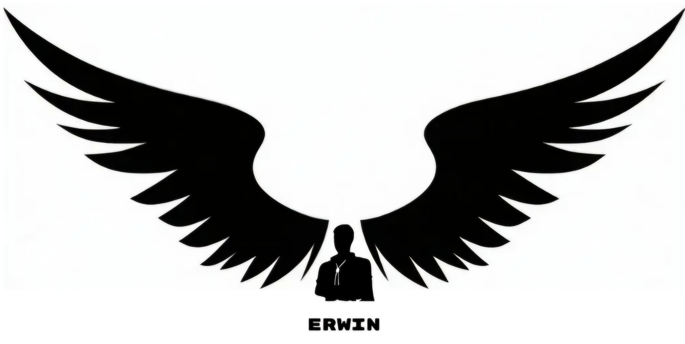

## Detected Bugs

1. https://github.com/ethereum/solidity/issues/14719 (medium impact, confirmed, fixed, type) ✅
2. https://github.com/ethereum/solidity/issues/14720 (duplicate of 14719)
3. https://github.com/ethereum/solidity/issues/15223 (error handling) ✅
4. https://github.com/ethereum/solidity/issues/15236 (a probable duplicate, confirmed, fixed, type) ✅❌
5. https://github.com/ethereum/solidity/issues/15219 (low effort, low impact, confirmed) ✅
6. https://github.com/ethereum/solidity/issues/15468 (low effort, low impact, confirmed, a probable duplicate) ✅
7. https://github.com/ethereum/solidity/issues/15469 (smt) ✅
8. https://github.com/ethereum/solidity/issues/15483 (not a bug, but a workaround)
9. https://github.com/ethereum/solidity/issues/15525 (documentation error, workaround) ✅
10. https://github.com/ethereum/solidity/issues/15483 (documentation error) ✅
11. https://github.com/ethereum/solidity/issues/15565 (wait for confirmation, error handling)
12. https://github.com/ethereum/solidity/issues/15564 (wait for confirmation, error handling)
13. https://github.com/ethereum/solidity/issues/15567 (wait for comfirmation, error handling)
14. https://github.com/ethereum/solidity/pull/15566 (wait for confirmation, documentation error)
